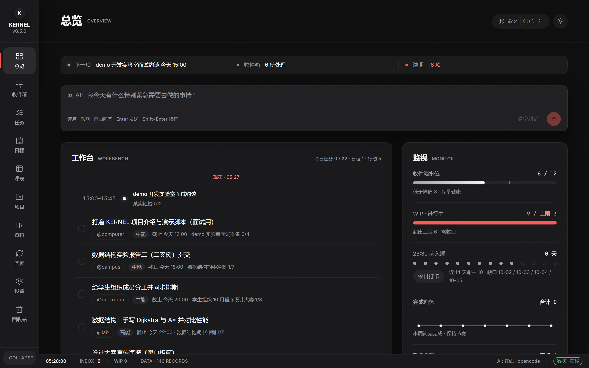
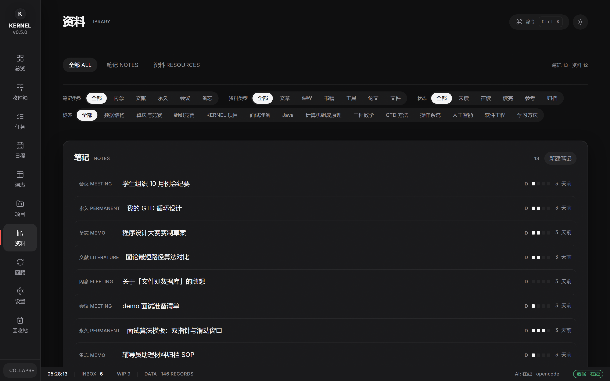

# KERNEL

> 文件即数据库，opencode 即大脑，网页即驾驶舱。

KERNEL 是一个本地优先的个人事务工具：课表、任务、日程、项目、资料、笔记和复盘收在一个地方。数据是你自己电脑上的 JSON 文件，AI 跑在本机的 opencode 上，不经过任何服务器。



项目名来自操作系统内核：进程对应任务 / 项目，内存对应资料，I/O 对应收件箱，调度器对应日程，GC 对应回顾。

系统不按身份分区——学生、助理、竞赛负责人这些身份都只是标签，在视图里筛。一级导航只有一套通用循环：捕捉 → 澄清 → 组织 → 执行 → 回顾。为什么这么设计，见 [ADR-0002](docs/decisions/0002-no-role-silos.md)。

## 快速开始

需要 Node.js 18+。

```bash
npm install
npm run dev
```

打开 http://localhost:5173 。`npm run dev` 会同时拉起三样东西：

| 端口 | 是什么 |
|---|---|
| 5173 | 前端（Vite） |
| 4097 | 数据服务（唯一写入路径） |
| 4096 | opencode serve（AI） |

想一上来就有内容看，先跑 `npm run seed`，会写一份演示数据到 `data/`。

其他命令：

```bash
npm run build                # 生产构建
npm run preview -- --host    # 预览构建产物（含数据服务）
npm run dev:web              # 只开前端（数据服务离线时只读）
npm run server               # 只开数据服务
npm run installer            # 打 Windows 安装包（见下）
```

手机上用：连同一个 WiFi，`npm run dev -- --host`，然后手机打开 `http://<电脑局域网IP>:5173`。防火墙和常见问题见 [docs/07-DEPLOYMENT.md](docs/07-DEPLOYMENT.md)。

## Windows 安装包

不想装 Node.js，就用安装包：

1. 从 GitHub Releases 下载 `KERNEL-Setup-x.y.z.exe`；
2. 双击，选安装目录（比如 `D:\KERNEL`；别装到 `C:\Program Files`，那里 Windows 不让程序写数据）；
3. 装完从开始菜单或桌面图标启动，目标电脑不用装任何东西。

数据在 `<安装目录>\data`，和程序放在一起，整个文件夹能直接拷到别的电脑。卸载时程序删掉，`data\` 会保留。

安装包由 `scripts/build-installer.mjs` 打包（用仓库内置的 Inno Setup 编译器，不用另外装），脚本在 `installer/KERNEL.iss`。

## 能做什么

- **收件箱**：把一句话、一张截图、一个文件丢进去。AI 先读一遍，给出「这该变成什么」的建议——任务、日程、笔记还是资料——你确认后才写库，它不会自作主张。
- **任务 / 项目**：截止时间、优先级、子任务；项目有「下一步」和状态（进行中 / 暂停 / 将来 / 已完成）。
- **日程 / 课表**：日程按天排，也能翻已结束的；课表是单独一页，支持单双周、连堂合并、按周切换。
- **资料 / 笔记**：笔记用 Markdown，可以逐层「蒸馏」成更短的版本；投进来的文件会自动附一句简介。
- **踪迹**：随手记一句「我刚刚做了什么」（可配图），按时间排成动态流或时间线；也能让 AI 从收件箱、对话里替你识别入账。



- **回顾**：每周 / 每月出一份复盘报告，AI 写、自动归档，可翻历史。
- **总览**：直接问库里的日程、任务、笔记；也能让它改某个日程的时间——改之前先给你看新旧对照，点「应用」才写。

## 技术架构

浏览器里是 Vite + React 19 + TypeScript，样式用原生 CSS 变量，没有 UI 框架。真正动数据的是一个本机 Node 进程（`server/`），它同时干三件事：唯一写入口（Zod 校验 → 原子写 → 追加审计日志）、给前端提供 `/api`、代理 AI 请求。

```
浏览器 ──/api──▶ 数据服务 127.0.0.1:4097 ──▶ data/*.json
                     │
                     └──▶ opencode serve 127.0.0.1:4096 ──▶ DeepSeek
```

两个服务都只监听 `127.0.0.1`，不会暴露到局域网。

数据就是文件：`data/` 下一记录一文件，ID 稳定（`t-0001` 式），UTF-8。可以直接 diff、备份、整目录迁移。进度、计数这类派生值不落盘，运行时算。

## 环境配置

**运行环境**：Node.js 18+、npm；Windows 10 / 11（直接跑 Windows 侧，不用 WSL）。

**依赖**：`react` `react-dom` `react-router-dom` `zod` `write-file-atomic` `@opencode-ai/sdk` `date-fns` `clsx` `cmdk` `motion` `lucide-react` `react-markdown` `@fontsource-variable/inter` `@fontsource/jetbrains-mono`
**开发依赖**：`vite` `typescript` `@vitejs/plugin-react` `@types/react` `@types/react-dom` `innosetup-compiler`

**环境变量**（模板见 [`.env.example`](.env.example)）：

| 变量 | 用途 | 默认 |
|---|---|---|
| `DEEPSEEK_API_KEY` | AI 用的 DeepSeek Key | 空 |
| `KERNEL_OPENCODE_URL` | opencode serve 地址 | `http://127.0.0.1:4096` |
| `KERNEL_OPENCODE_BIN` | 指定 opencode 可执行文件 | 空（查 PATH） |
| `OPENCODE_SERVER_PASSWORD` | 数据服务 ↔ opencode 的本地口令 | 空 |

Key 也可以不写环境变量，直接在应用里填：设置 → AI 集成。它存在本机 `data/meta/secrets.json`（已 gitignore，不进版本库）。

## 开发环境（AI 协作）

KERNEL 的代码主要是在 AI 编码代理的协作下写出来的——这套环境本身也是项目的一部分。

- **编码代理**：[opencode](https://opencode.ai)（本机运行，端口 4096）。根目录的 [`AGENTS.md`](AGENTS.md) 就是给它的操作手册：速览、命令、数据纪律、文档义务都写在那里。
- **模型**：DeepSeek Flash（`deepseek/deepseek-flash`），走 DeepSeek API；Key 只存本机（环境变量，或「设置 → AI 集成」）。
- **插件**：`oh-my-openagent`（多智能体编排——`oracle` 复核、`librarian` 查文档与开源实现、`explore` 搜代码、`metis` 预规划、`momus` 计划评审、`sisyphus` 编排派发等）与 `ecc-universal`，另有一个本地守卫插件。
- **MCP**：GitHub（GitHub Copilot MCP）；另接入 Context7 查库文档。
- **技能**：按需加载的 60+ 个 skill（前端设计、调试、去 AI 味、图表、文档格式、端到端测试等）。
- **运行时**：Node.js 22 · npm 10 · Python 3.13。
- **协作留痕**：[`docs/ai-worklog/`](docs/ai-worklog/) 按时间记录核心协作（日期 / 提交 / Prompt / 结果），并附 [`COMMITS-MAP.md`](docs/ai-worklog/COMMITS-MAP.md) 提交对照。

## 文档

- [docs/00-DESIGN-BRIEF.md](docs/00-DESIGN-BRIEF.md) — 项目宪法（事实源）
- [docs/01-PROJECT-BRIEF.md](docs/01-PROJECT-BRIEF.md) — 背景、用户画像、设计立场
- [docs/02-ARCHITECTURE.md](docs/02-ARCHITECTURE.md) — 技术选型与架构
- [docs/03-DESIGN-SYSTEM.md](docs/03-DESIGN-SYSTEM.md) — 设计 token 与组件规范
- [docs/04-DATA-MODEL.md](docs/04-DATA-MODEL.md) — 数据模型
- [docs/05-FILE-TREE.md](docs/05-FILE-TREE.md) — 目录结构
- [docs/06-ROADMAP.md](docs/06-ROADMAP.md) — 版本路线
- [docs/07-DEPLOYMENT.md](docs/07-DEPLOYMENT.md) — 运行、局域网、FAQ
- [docs/decisions/](docs/decisions/) — 决策记录（ADR）
- [CHANGELOG.md](CHANGELOG.md) · [TASK_BOOK.md](TASK_BOOK.md) — 变更日志与任务台账

## 团队信息

| 项 | 内容 |
|---|---|
| 团队名称 | 【待填写】 |
| 团队成员 | 【待填写】 |
| 组别 | 【待填写】 |
| 学校 | 【待填写】 |
| 指导教师 | 【待填写】 |

本项目只在本机运行，不发布到公网。
